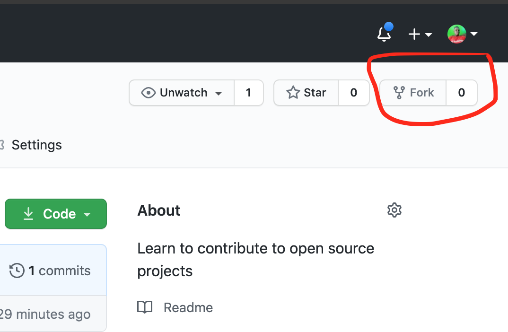
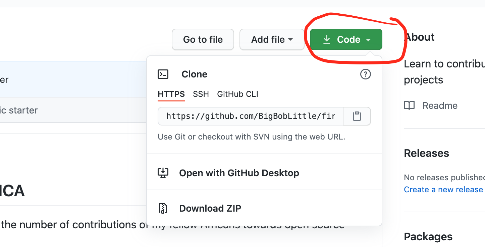

## FIRST CONTRIBUTION AFRICA

Often atimes i find it very heart-breaking, the number of contributions of my fellow Africans towards open source projects.  
After a few research, i came to realize that most people are very informed and misguided on how to contribute to open sources projects.  
They always feel its very difficult, which isn't the case. I created this repo to provide a guide to intrested individuals on the basics  
of contributing to open source projects, basically, **fork -> clone -> edit -> pull request** workflow that you'll encounter often as a contributor. Please make sure you have **git** installed on your local computer and follow the simple guide below to make your first contribution.

## FORK THIS REPOSITORY
       
Click on the `**fork**` button to create a copy of this repository into your own github account. 
Please don't forget to give this repo a star ⭐ as well. Thanks for doing that.          
   

## CLONE THE REPOSITORY  
    
Click on the `code` icon above and copy the link provided in the dropdown. Open your terminal and type in    
```
git clone paste-your-copied-link-in-here    
The above command will clone your version of the repo onto your local machine    
*Eg.* git clone https://github.com/BigBobLittle/first-contribution-africa.git 
```

## Change directory into the recently cloned folder 

``` cd name-of-clone-folder    
*Eg.* cd first-contribution-africa  
```  


## CREATE A BRANCH   
``` 
create a branch with the name of your choice  
git branch -b your-prefered-branch-name 
*Eg.* git branch -b big-bob-little-branch
```   


## EDIT THE CODE 
Open the `Contributors.md` in your text editor of choice, add your name and github profile link `[your name](your github link)` in the list.   
Please note, in real projects, you have to add or modify the actual code in this stage. Add your actual contribution to the code. 


## PUSH BACK TO GITHUB   
push your branch back to github   

__type the following commands in your project root terminal__
```
git status 
git add *  
git commit -m "hooray, i also made a contribution to open source projects"    
git push origin name-of-your-branch-here   

eg. git push origin big-bob-little-branch 

``` 


## What next 
Contributing to open source projects will follow similar or same process. With the knowledge you have, go out there and create,    
contribute towards any open source project of your choice.   

You can follow me if you want on github. I will often share similar resources. Thank you 🙏


